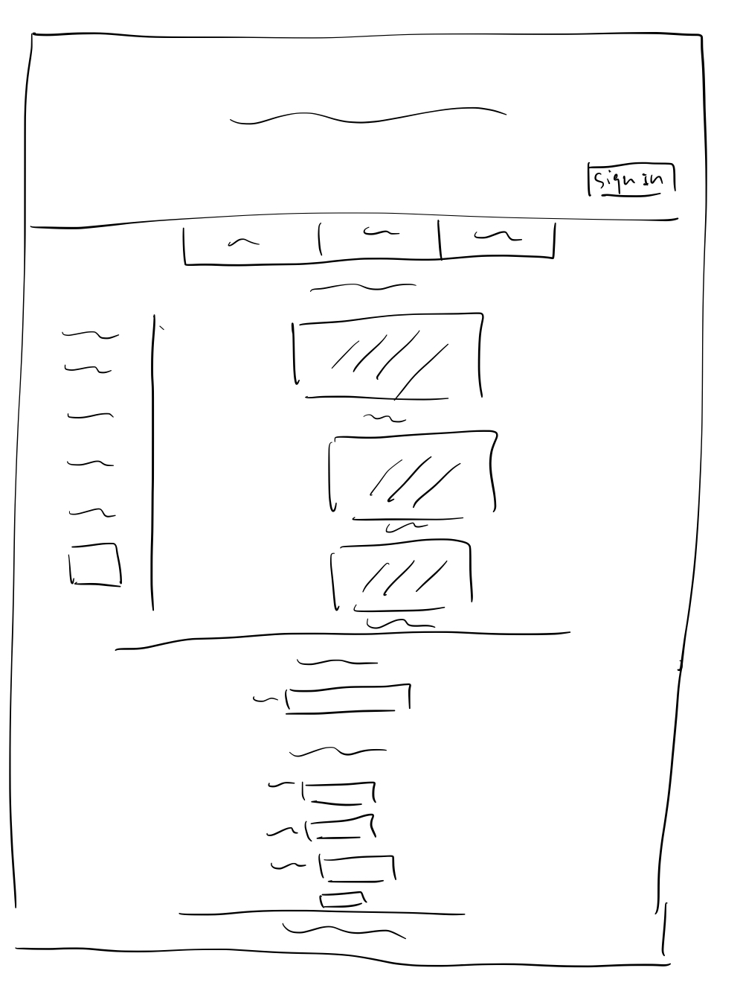

# Project 3: Design Journey

Be clear and concise in your writing. Bullets points are encouraged.

**Everything, including images, must be visible in Markdown Preview.** If it's not visible in Markdown Preview, then we won't grade it. We won't give you partial credit either. This is your warning.


## Design Plan

### Project 1 or 2
> Do you plan to reuse your Project 1 or 2 site?
> Which project?

Yes, Project 2.

> If yes, please include sketches of the site's current design (you may copy the "final" sections from those assignments.)


This is a sketch of my menu page.


This is a sketch my employees page.

### Describe your Media Catalog (Milestone 1)
> What will your collection be about?
> What type of media will your site display? (images, videos, audio)

My collection will be food items provided at the restaurant Oishii Bowl, where each entry associates the name of the dish with an image of it. The type of media will be images.

### Audiences (Milestone 1)
> Briefly explain your site's audiences. Be specific and justify why each audience is appropriate for your site.
> You are required to have **two** audiences: "information consumers" and "site administrators"

Information Consumer: My consumers are customers to Oishii Bowl. They could be living near Collegetown or are just local residents around the Ithaca area who love and want to explore Japanese and Chinese cuisines. The consumers are able to view the collections of food provided at Oishii Bowl along with images of them, which make them more appetizing.

The audience is appropriate because my site aims to publicize delicious food at Oishii Bowl to more people, and the local residents in Ithaca would be interested in a menu that specifies the information of the food that are offered at this restaurant, as well as pictures of them, so that they can find the items they want to eat or try out.

Site Administrator: My site administrators are the employees at Oishii Bowl. They are able to login on the website and make changes to the menu items by adding, deleting, or editing the current food catalog.

The audience is appropriate because the workers at Oishii Bowl would wish to have access to the dataset so that they can maintain the menu to be up to date. Through my site, they will be able to modify the records at anytime in order to provide their customer the newest recipes.

### Personas (Milestone 1)
> Your personas must have a name and a "depiction". This can be a photo of a face or a drawing, etc.
> There is no required format for the persona.
> You may type out the persona below with bullet points or include an image of the persona. Just make sure it's easy to read the persona when previewing markdown.
> Your personas should focus on the goals, obstacles, and factors that influence behavior of each audience.

> Persona for your "consumer" audience:


Avene is a first year PhD student at Cornell, coming from Florida, who lives in Collegetown and likes to visit the Starbucks store across the street from Oishii Bowl every Wednesday and Thursday to study. Before she heads home, she often goes to Oishii Bowl to buy food for dinner after studying. She sometimes also buys lunch there during the day after her classes ends. Avene loves Asian cuisine, especially any kinds of Japanese rice dons. Her favorite is a rice don covered by chicken and egg with caramelized onions, but she could not remember the name of the dish. She also likes to buy some appetizers from Oishii to bring home and share with her roommates. She has a limited budget for food every week, and she does not want to spend her money on overpriced items.


> Persona for your "administrator" audience:


Andreas is a 30-year-old worker at Oishii Bowl who graduated from Ithaca College years ago and now lives in Ithaca permanently. He goes to work every Monday, Wednesday, and Friday. He mainly takes in orders at the front desk but also help the store to insert new menu items into their database sometimes. He has very good memories and can recite all the current food items in the store with their prices. He, however, is not a native speaker of Japanese and sometimes spells the Japanese food names incorrectly. He loves his job, and he loves seeing his customers feeling fulfilled after enjoying the food they provide. This motivates him to come up with new ideas for the menu.


### Site Design (Milestone 1)
> Document your _entire_ design process. **We want to see iteration!**
> Show us the evolution of your design from your first idea (sketch) to the final design you plan to implement (sketch).
> Show us the process you used to organize content and plan the navigation, if applicable (card sorting).
> Plan your URLs for the site.
> Provide a brief explanation _underneath_ each design artifact. Explain what the artifact is, how it meets the goals of your personas (**refer to your personas by name**).
> Clearly label the final design.


This is the menu page for consumers when not logged in. Customers like Avene will be able to browse different items provided at Oishii Bowl by looking at multiple images and names in one single screen, which is convenient for comparison. Avene will also be able to filter out categories of foods on the side bar to only look at her favorite rice dons. With the sort buttons on top of the catalog, Avene can sort the items according to their prices.


This is the menu page for administrators when logged in. Employees like Andreas will be able to look at all entries in the catalog holistically on this page, and he will be able to add new items using the side bar form on the left. He is also able to perform actions like consumers do, such as filtering out categories. After logged in, Andreas can see his name on the top right corner with a logout button to end his session. This name message tells him that he is logged in right now.


This is an example entry page with details. The image of the item is position on the left, much more enlarged from when presented in the catalog. The name, price, description, and tags/categories are listed on the right hand side. Avene can look at dishes more closely using this page: the enlarged image will look appetizing, and she can read more about the food description and its tags. Andreas, when logged in, can also edit or delete the item on this page using the buttons listed.


This is the final version of the signature page with side bars for tags and add new entries forms separate from the entry images, convenient for admins.

### Design Patterns (Milestone 1)
> Write a one paragraph reflection explaining how you used the design patterns in your site's design.

I designed my page to have good usability and accessibility by properly guiding the user's eyes. The side bar containing the tags and new item entry form (for Andreas/employee) is on the left hand side, which is its conventional position and reflects user's habit to read from left to right. Enough blank spaces are reserved between blocks of texts, forms, and images for better usability. The site adopts a clear hierarchy by bolding and enlarging menu and form titles as headings, as well as greying out descriptions/ minor details for entry information. The forms are usable by properly aligning the text boxes at the center, and the submit buttons (which are only used when necessary) are centered right below the form inputs. On the details page for every entry, the image is enlarged and placed on the left, and the name, description, price, as well as tags are placed on the right side of the image. Avene and Andreas can therefore browse both the item picture and its information on the same screen. They can make actions on the right hand side while looking at the appealing image on the left. The admin login button is positioned on the top right corner of the site according to convention. Andreas will be able to see "Hi, Andreas!" after he logs in on the site, which is informative and personalized. The query string parameters are designed to be clear and concise for short and memorable URLs. A 404 page is also designed for Andreas and Avene to not get lost when navigating off the site.


## Implementation Plan

### Requests (Milestone 1. Revise in Milestone 2)
> Identify and plan each request you will support in your design.
> List each request that you will need (e.g. view image details, view gallery, edit book, tag product, etc.)
> For each request, specify the request type (GET or POST), how you will initiate the request: (form or query string URL), and the HTTP parameters necessary for the request.

- Request: view item details
  - Type: GET
  - URL: /details?id=X
  - Params: id _or_ item_id (item.id in DB)

- Request: filter tags (categories)
  - Type: GET
  - URL: /X?=1
  - Params: tag

- Request: view all entries
  - Type: GET
  - URL: /
  - Params: view_all

- Request: sort based on price
  - Type: GET
  - URL: /?sort=X
  - Params: sort

- Request: edit entry
  - Type: POST
  - Params: new_title, new_price, new_description

- Request: delete entry
  - Type: POST
  - Params: delete_entry

- Request: add tag
  - Type: POST
  - Params: add_tag

- Request: delete tag
  - Type: POST
  - Params: delete_tag

- Request: add image
  - Type: POST
  - Params: add_img

- Request: employee login
  - Type: POST
  - Params: username, password

- Request: customer login
  - Type: POST
  - Params: username, password

- Request: user sign up
  - Type: POST
  - Params: name, username, password, confirm_password


### Database Schema (Milestone 1. Revise in Milestone 2)
> Describe the structure of your database. You may use words or a picture. A bulleted list is probably the simplest way to do this. Make sure you include constraints for each field.

> Hint: You probably need a table for "entries", `tags`, `"entry"_tags` (stores relationship between entries and tags), and a `users` tables.

> Hint: For foreign keys, use the singular name of the table + _id. For example: `image_id` and `tag_id` for the `image_tags` (tags for each image) table.

Table: foods
- id: INTEGER {NOT NULL, PRIMARY KEY, AUTOINCREMENT, UNIQUE},
- food: TEXT {NOT NULL},
- food_type: TEXT {NOT NULL},
- description: TEXT {},
- price: REAL {NOT NULL},
- file_ext: TEXT {NOT NULL},
- citation: TEXT {}

Table: entries
- id: INTEGER {NOT NULL, PRIMARY KEY, AUTOINCREMENT, UNIQUE},
- food: TEXT {NOT NULL},
- description: TEXT {NOT NULL},
- price: TEXT {NOT NULL},
- file_ext: TEXT {NOT NULL},
- citation: TEXT {}

Table: tags
- id: INTEGER {NOT NULL, PRIMARY KEY, AUTOINCREMENT, UNIQUE},
- tag: TEXT {NOT NULL}

Table: food_tags
- id: INTEGER {NOT NULL, PRIMARY KEY, AUTOINCREMENT, UNIQUE},
- food_id: INTEGER {NOT NULL, FOREIGN KEY},
- tag_id: INTEGER {NOT NULL, FOREIGN KEY}

Table: users
- id: INTEGER {NOT NULL, PRIMARY KEY, AUTOINCREMENT, UNIQUE},
- name: TEXT {NOT NULL}
- username: TEXT {NOT NULL, UNIQUE},
- password: HASHED {NOT NULL}

Table: sessions
- id: INTEGER {NOT NULL, PRIMARY KEY, AUTOINCREMENT, UNIQUE},
- user_id: INTEGER {NOT NULL},
- session: TEXT {NOT NULL, UNIQUE},
- last_login: TEXT {NOT NULL},
- FOREIGN KEY(user_id) REFERENCES users(id)

Table: groups
- id: INTEGER {NOT NULL, PRIMARY KEY, AUTOINCREMENT, UNIQUE},
- name: TEXT {NOT NULL UNIQUE}

Table: memberships
- id: INTEGER {NOT NULL, PRIMARY KEY, AUTOINCREMENT, UNIQUE},
- group_id: INTEGER {NOT NULL},
- user_id: INTEGER {NOT NULL},
- FOREIGN KEY(group_id) REFERENCES groups(id),
- FOREIGN KEY(user_id) REFERENCES users(id)

### Database Query Plan (Milestone 1. Revise in Milestone 2)
> Plan your database queries. You may use natural language, pseudocode, or SQL.

1. Show all entries with their tags:
```
Left join food_tags with tags and foods table to relate all items with their tags.
```

2. Show certain entries with selected tags:
```
Left join food_tags with tags and foods table to relate all items with their tags, where tags equal to the ones selected by user.
```

3. Show sorted data table
```
Select all foods and order by price in ascending/descending order.
```

4. Search results
```
Select all foods where food name or description contains the search query.
```

### Code Planning (Milestone 1. Revise in Milestone 2)
> Plan any PHP code you'll need here using pseudocode.
> Use this space to plan out your form validation and assembling the SQL queries, etc.
> Tip: Break this up by pages. It makes it easier to plan.

```
- if user logs in:
  - if user is admin (username & pw exist in DB):
    - show employee page with modification options
    - show each detailed entry with edit/delete options
    - change "login" to "logout"
    - if user enters new food item:
      - store information as sticky variables
      - if entering form is valid:
        - add new item to DB
      - if entering form not valid:
        - provide feedback messages
    - if user deletes item:
      - provide confirmation message
    - if user edits item:
      - if edits are valid:
        - store edits as new info for entry
      - if edits not valid:
        - provide feedback messages
  - else:
    - provide feedback messages about invalid login info
- else:
  - if user selects tags:
    - retrieve entries and images with those tags from DB
  - else:
    - retrieve all entries and images from DB
```


## Submission

### Audience (Final Submission)
> Tell us how your final site meets the needs of the audiences. Be specific here. Tell us how you tailored your design, content, etc. to make your website usable for your personas. Refer to the personas by name.

For my final site, I deployed many user-friendly designs, contents, navigation, and user access controls for different types of users. Avene, as a customer to Oishii Bowl, has the authorization to look at Signature Items and Menu page (she does not need to sign in; only admins can sign in). She can browse through different tags and select one to filter out specific items. There is also an "All Items" button for her to return to viewing all entries. She can also directly click on each entry image to see specific details, such as the item's name, tags, price, description, and citation source. With a link she can easily return to Signature Items page. On the Menu page, Avene is able to search, filter, or sort the entire menu items on the catalog data table (from Project 2), which includes the signature items.

The site's design is also aesthetically pleasing: the spacious layout of elements and the dark color scheme with gold, yellow, and white texts can ease Avene's mind and set her into the mood for a delicious Asian meal for the evening. The images on the main Signature Items page are presented rather large with high-resolution (comparing to normal website's product listings that cram tiny catalog images together on one screen). This can give Avene a bigger appetite, making her feel like she can smell the food across the screen.

For our Oishii Bowl employee, Andreas, this site allows him to log into his admin account and make changes to the items. The golden-bordered "Sign In" button, placed on the bottom right corner of header just as convention, is easy to be spotted for straightforward admin access control. When Andreas signs into his account, he then has more authorities to update the site. On the Signature Items page, he has access to add new tags and entries (with a button at the bottom of the tags side bar directing to the "add tag" & "add entry" forms located at the bottom of the page). If he has not signed in yet, at the location where the forms should have shown up, there is a button to direct him to the login page. Using the forms, Andreas can input unique tag names or upload new food images (along with title, price, description, tags etc.) to update the database. If the inputs are not valid, Andreas will receive a feedback message at the top of the page to direct him to the form and try again. There are also feedback messages directly on the form inputs to tell him which inputs were invalid. These interactive designs give the user a very friendly experience to update the database.

When clicking into each individual entry, Andreas can not only read the entry details but also edit or delete the entry. When editing, Andreas can update the text inputs to a non-empty value and select more or less tags. If his text input was empty, when pressing the "Save" button, he will receive a message that reminds him to not leave any input blank, and the original text would not be deleted because of his update. This feature is to prevent users from accidentally deleting entry details and forgetting what the original inputs were. If Andreas clicks on "Delete," the entry page will disappear, and a feedback message will notify him that the item (with name specified) was successfully deleted. If he tries to access a deleted (or non-existing) entry page, he will receive the message that the item does not exist and provides a link back to the "Signature Items" page. These feedback messages make the site very easy to navigate for the users.


### Additional Design Justifications (Final Submission)
> If you feel like you haven’t fully explained your design choices in the final submission, or you want to explain some functions in your site (e.g., if you feel like you make a special design choice which might not meet the final requirement), you can use the additional design justifications to justify your design choices. Remember, this is place for you to justify your design choices which you haven’t covered in the design journey. You don’t need to fill out this section if you think all design choices have been well explained in the design journey.

N/A


### Self-Reflection (Final Submission)
> Reflect on what you learned during this assignment. How have you improved from Project 1? What things did you have trouble with?

Project 3 was a huge step from any past projects I have done in the web development classes. With PHP and SQLite, I was able to add so many features such as login/logout sessions, user access controls, add/delete database items, and update item details, etc. My site has become more interactive and user-centered than my past projects. I had the most trouble with debugging my PHP codes on conditional statements, variables, and retrieval of selecting database items. There is definitely still a long way for me to go in the path of web development.


### Grading: Mobile or Desktop (Final Submission)
> When we grade your final site, should we grade this with a mobile screen size or a desktop screen size?

Desktop


### Grading: Step-by-Step Instructions (Final Submission)
> Write step-by-step instructions for the graders.
> The project if very hard to grade if we don't understand how your site works.
> For example, you must login before you can delete.
> For each set of instructions, assume the grader is starting from /

Only the tab "Signature Items" is related to Project 3. The "Menu" and "For Employees" tabs are completely from Project 2 (except for admin login on the "For Employees" page).

Viewing all entries:
1. Do not have to login to view all entries

View all entries for a tag:
1. No login needed
2. Select any tag from the left side bar to view specific entries

View a single entry and all the tags for that entry:
1. No need to login
2. Click on any entry image on "/" page to view a single entry and its tags and other details

How to insert and upload a new entry:
1. Has to login as admin (andreas) via sign in button in the header, or via "employee? add new listings here" button that directs to a "sign in" button.
2. After logging in, insert new entry as directed by the form

How to delete an entry:
1. Has to login as admin
2. Click on any entry you want to delete and click "Delete"

How to view all tags at once:
1. No need to login
2. Click on "Signature Items" (which is main page, "/") tab to view all
3. Can also just click on the "Oishii Bowl" title in the header to return to the main page
4. If already viewing a specific tag, click "All Items" on the side bar to view all entries

How to add a tag to an existing entry:
1. Has to login as admin
2. Click on an entry image and click "Edit" to follow the instruction on the form for adding tags for that entry

How to remove a tag from an existing entry:
1. Has to login as admin
2. Click on an entry image and click "Edit" to follow the instruction on the form for deleting tags for that entry
